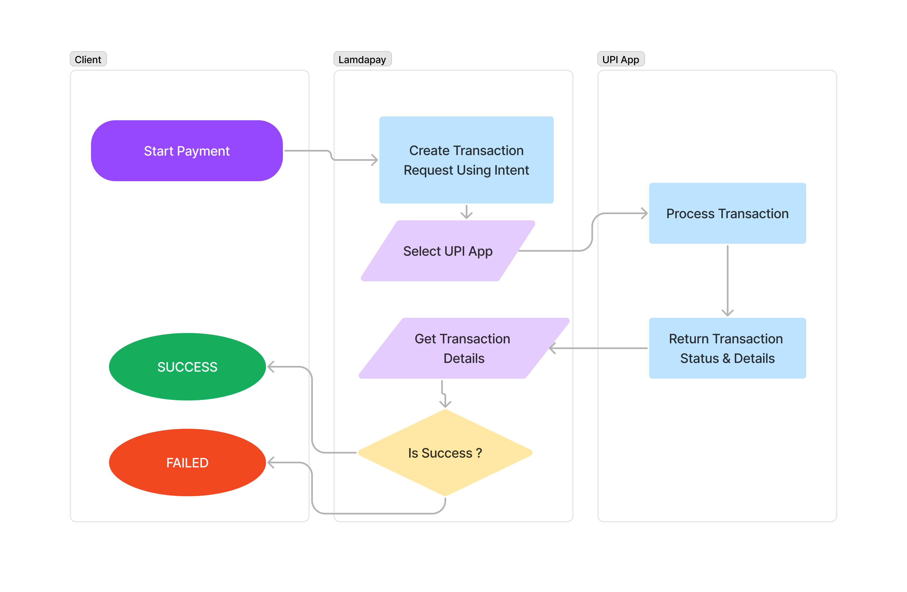

# Lamdapay - UPI Payments Android SDK (FREE Payment)

Welcome! Seamlessly incorporate our advanced UPI (Unified Payments Interface) Payments SDK into your application. Our project offers an Android SDK, a server-side SDK (available as an NPM Module), and we're actively developing a web SDK. Get started now!


## Flow


## Demo Screenshots


## Getting Stated


### 1.  Add Dependeny

This library is included in mavenCentral.
  ``` kotlin
  repositories {
      ...
      mavenCentral()
  }
  ```

  ``` kotlin
    dependencies {
      // Lamdapay Library
          implementation 'io.ankitprs.lamdapay:lamdapay:LATEST_VERSION_HERE'

    }
  ```

### 2. Initializing Lamdapay
   Initialized Lamdapay in to your main activity

   ``` kotlin
    val   lamdapayupi = PayUsingUpi(this) {
          this.payeeVpa = "example@upi"
          this.payeeName = "Ankit Prasas"
          this.payeeMerchantCode = "12345"
          this.transactionId = "T202009034345"
          this.transactionRefId = "T202009034345"
          this.description = "description"
          this.amount = "1001.00"
    }
   ```

  ### 3. Initiate Payment

  ``` kotlin
  lamdapayupi.startPayment()
  ```

  ### 3. Transaction Status

  Add `PaymentStatusListener` To your main activity

  ``` kotlin
    override fun onTransactionCompleted(transactionDetails: TransactionDetails) {
        Log.d("TransactionDetails", transactionDetails.toString())
    }

    override fun onTransactionCancelled() {
        toast("Cancelled by user")
    }

  ```
  Set payment status listener

  ``` kotlin
    lamdapayupi.setPaymentStatusListener(this)
  ```
  
  Remove payment status listener

  ``` kotlin
    override fun onDestroy() {
      super.onDestroy()
        lamdapayupi.removePaymentStatusListener()
    }

  ```

| Kotlin (Field) | Description |
| ----------- | ----------- |
| transactionId      | Returns Transaction ID       |
| responseCode   | Returns UPI Response Code        |
| approvalRefNo   | Returns UPI Approval Reference Number (beneficiary)        |
| transactionStatus   | Returns Status of transaction. (SUBMITTED/SUCCESS/FAILURE)        |
| transactionRefId   | Returns Transaction reference ID passed in input        |
| amount   | Returns Transaction amount        |

## How to Contribute

Lamdapay welcomes contributions from the community to improve and enhance the project. If you would like to contribute, please follow these steps:

1. Fork the Lamdapay repository to your GitHub account.
2. Create a new branch for your contribution.
3. Make your desired changes and improvements.
4. Test your changes thoroughly.
5. Submit a pull request, describing the details of your contribution.

Please ensure that your contributions align with the project's coding standards and guidelines.

## License

Lamdapay is released under the [MIT License](https://opensource.org/licenses/MIT). You are free to use, modify, and distribute the project according to the terms of the license.

## Contact

If you have any questions, suggestions, or feedback regarding the Lamdapay project, please feel free to reach out to us via email at [ankitpr2001@gmail.com](mailto:ankitpr2001@gmail.com). We value your input and appreciate your interest in contributing to the project.

Thank you for your support and involvement in making Lamdapay a powerful and cost-effective UPI Payments SDK!

# Reference

 https://github.com/PatilShreyas/EasyUpiPayment-Android
